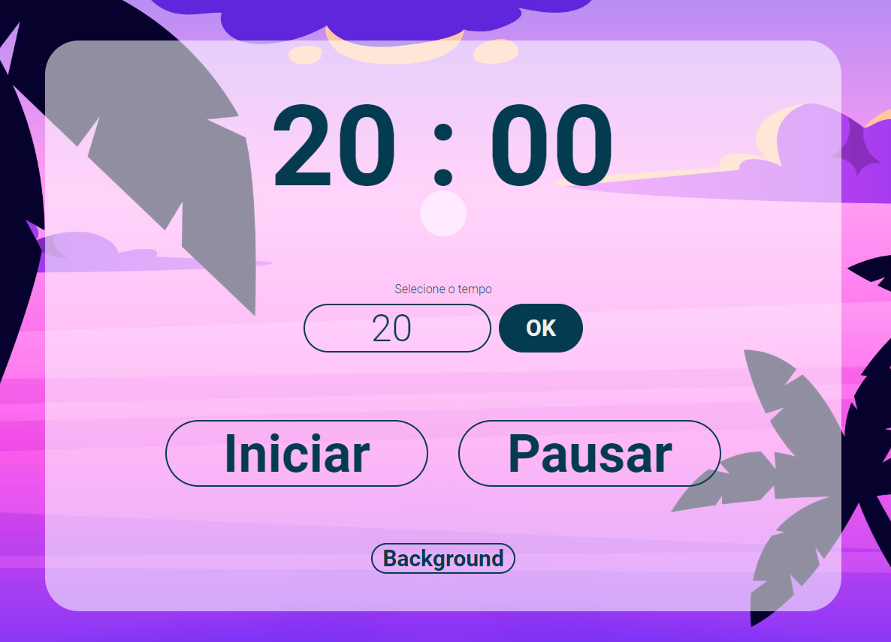

# Aplicação pomodoro em JAVASCRIPT!
**Este projeto foi constuído utilizando javascript, html e css e consiste em um timer para auxiliar na prática do pomodoro, que é uma prática para auxiliar no estudo ou trabalho**

## Acesse o link do repositório no github pages
Link de acesso ao pomodoro online pelo github pages: [Pomodoro javascript](https://caiquepiazzaroli.github.io/pomodoroJavascript/).

## Para saber mais sobre a técnica pomodoro
Acesse a página no [wikipedia](https://pt.wikipedia.org/wiki/T%C3%A9cnica_pomodoro) para saber mais sobre como funciona esta tecnica!

## Instruções para executar o repoitório. 
1. Baixe o repositório em sua máquina através do git ou pelo link direto no github.
2. Extraia o repositório para uma pasta.
3. Execute o arquivo "Index.html".

## Imagem
